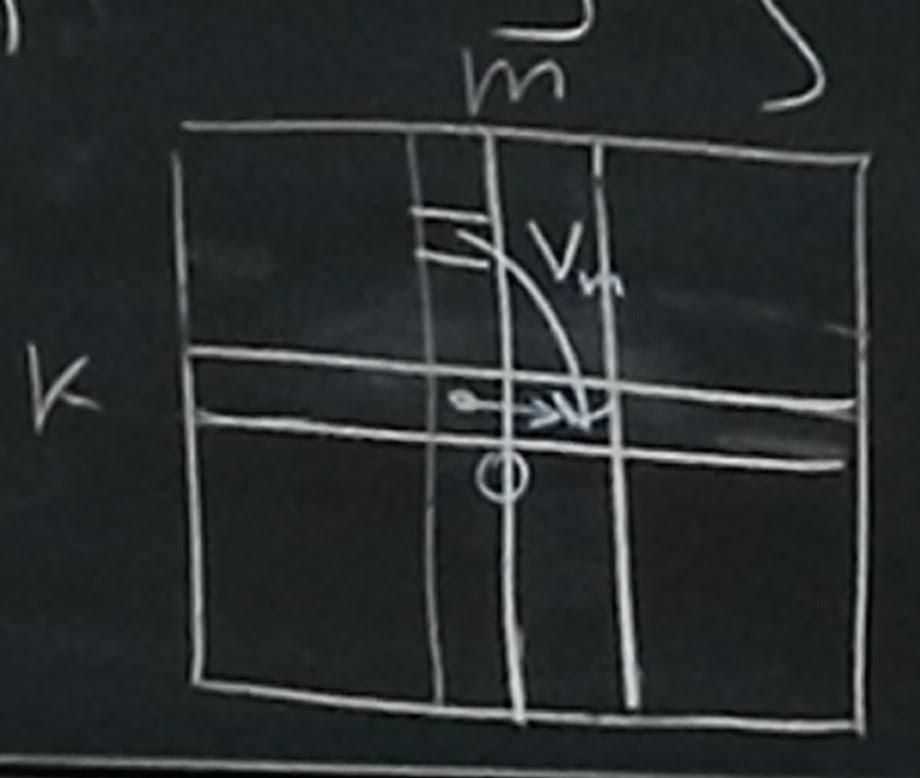

## Как хранить графы?

Граф — $G=(V, E)$.

1. матрица смежности:
    \+ $O(1)$ на проверку $(i, j) \in E$
    — Размер $\Theta(|V|^2)$
    — $\Theta(|V|^2)$ на обход всех рёбер

2. списки смежности
   \+ Размер $O(|V| + |E|)$
   \+ Обход  $O(|V| + |E|)$
   — $O(|V|)$ на проверку $(i, j) \in E$

3. матрица инцидентности (почти не используется)
   \+ подходит для мультиграфов


## Поиск в глубину

```python
def Explore(v):
  visited[v] = true
  previsit(v)

  for u : (v, u) in E    # O(E)
    if not visited[u]
      Explore(v)         # O(V) вызовов Explore

  postvisit(v)
```


```python
def DFS(G):
  for i = 1 to |V|:
    visited[i] = False

  for v = 1 to |V|:      # O(V)
    if not visited[v]:
      Explore(v)
```

Итого: $O(|V| + |E|)$ _(для списков смежности)_ и $O(|V|^2)$ для матриц смежности.


## Компоненты связности в неориентированном графе

Как решить задачу с помощью $DFS$'a?

Заведём массив, который содержит компоненты вершин. То есть для каждой вершины мы храним, в какой компоненте она находится.

```python
def CC(G):
  for v = 1 to |V|:
    CC[v] = 0

  global counter = 0

  for v = 1 to |V|:
    counter += 1
    if CC[v] == 0:
      Explore(v)
```

```python
def previsit:
  CC[v] = counter
```

## Поиск циклов в неориентированном графе

$DFS$ позволяет нам построить дерево по графу. Соответственно, если в процедуре `Explore` вершина $v$ уже была посещена, это означает существование цикла.

Чтобы вернуть цикл, добавим в массив сначала вершину $v$, а потом будем возвращаться вверх по стеку вызовов, добавлять просматриваемую вершину и так до тех пор пока не не встретим вершину $v$.

**Утверждение**. В графе есть цикл $\Leftrightarrow$ в обходе $DFS$ есть обратное ребро.

**Док-во**. Если в графе есть цикл, рассмотрим цикл. Там возьмём первую вершину. Все остальные вершины рассмотрим тот же самый $Explore$, но одно ребро мы пройти не сможем (количество рёбер в дереве меньше чем вершин, а в цикле их столько же, то есть одно ребро останется), оно и смотрит наверх.

Обратно очевидно, если есть обратное ребро, то вот он цикл.


## Поиск в глубину в ориентированном графе

#### Поиск циклов

см. картинку

1. рёбра обхода
2. <span style="color:green">прямые</span> рёбра
3. <span style="color:red">перекрёстные</span> рёбра
4. <span style="color:blue">обратные</span> рёбра

**Утверждение**. В орграфе есть цикл $\Leftrightarrow$ в обходе есть обратное ребро.

Будем записывать время заходи и исхода из вершин.

```python
global counter = 1   # time

previsit(v):
  pre[v] = counter
  counter += 1

postvisit(v):
  post[v] = counter
  counter += 1
```

**Утверждение**. Для $\forall  (u, v) \in E$ отрезки на числовой прямой $[\ pre[v],\ post[v]\ ]$ и $[\ pre[u],\ post[u]\ ]$ либо не пересекаются, либо один содержит другой. То есть не может быть такой картинки:

```
 v *------------*
        *----------* u
```

Рассмотрим различные соотношения отрезков для ребра $(u, v)$.

1. Ребро дерева / <span style="color:green">прямое</span> ребро
    ```
     u *------------*
          v *-----*
    ```

2. <span style="color:blue">Обратное</span> ребро
    ```
     v *------------*
          u *-----*
    ```

3. <span style="color:red">Перекрёстное</span> ребро. Обратное положение невозможно.
    ```
     v *------* *-------* u
    ```

Таким образом, если мы найдём обратное ребро, мы найдём цикл.


## Топологическая сортировка (всегда для ациклических графов)

Топологическая сортировка — это такой порядок вершин что: $\forall (u,v) \in E:\ \ T[i] < T[v]$.

По сути мы уже решили эту задачу, используя время выхода из вершин.

**Утверждение**. Вершина с максимальным $post$ — это вершина, которая ни от чего не зависит. Это исток (_source_, в неё не входит никакие рёбра).

Следствие. вершины в порядке убывания $post$ — это топологическая сортировка. (По индукции будем убирать вершину с максимальным post, и искать следующую с максимальным).


## Strongly connected components

**Утверждение**: в любом ациклическом графе есть сток и исток.

(Нужно просто походить по графу, мы либо уткнёмся в сток, либо зациклимся. Для истока аналогично, только идти в обратную сторону.)

**Утверждение**: $G$ — ациклический $\Leftrightarrow$ граф $G^R$ с инвертированными рёбрами — ациклический.

Если граф $G$ не ациклический (в нём есть цикл), то можно пройтись по тем же рёбрам в обратном направлении и найти цикл в $G^R$, обратно аналогично.

**Утверждение**. $G^R$ можно вычислить / построить за $O(|V| + |E|)$ по $G$, заданному списками смежности.

Если в списке было ребро $(3, 5)$, то нужно добавить к списку $G^R$ ребро $(5, 3)$. Соответственно это можно сделать за один проход по списку.

Компонента сильной связности — максимальное по включению подмножество $V$ такое что для $\forall u, v: \exists$ путь $u \rightarrow v$ и $\exists$ путь из $v \rightarrow u$.



**Определение**. Метаграф — граф компонент сильной связности.

**Утверждение**: метаграф ациклический. Если бы был цикл, то получилась бы одна компонента связности.

**Утверждение**: пусть есть две компоненты сильной связности $U$ и $V$. $H$ — множество рёбер компонент сильной связности.


$] (u, v) \in H$. Тогда $\max_{v \in U}{\{post[u]\}} > max_{v \in V}{\{post[v]\}}$. Максимальное время выхода из $u$ больше чем время выхода $v$.

1. Сначала попали в $U \rightarrow $ ок.
2. Сначала попали в $V$. В $U$ мы не попадём (потому что метаграф ациклический), и сможем попасть туда только при следующем вызове $DFS$. И тогда в $U$ у каждого будет время выхода больше.

**Следствие**: вершина с $\max post$ лежит в компоненте-истоке. (По транзитивности.)

Идея: раз мы нашли вершину с $\max post$, то запустим в ней $DFS$. Мы не сможем обойти весь граф (истоков может быть несколько). Но если мы обойдём $G^R$, то мы обойдём всю компоненту.

Отсортируем вершины в порядке убывания $post$, и перевернём рёбра графа. Затем запустим поиск компоненты связности.

**Утверждение**: если отсортировать компоненты в порядке убывания $\max \{ post[v] \}$, то получится топологическая сортировка.

```python
def SCC(G):
  DFS(G)
  G_r = invert(G)
  sort(G_r . V, max post) # сортируем вершины подсчётом
  СС(G_r)
```

Граф необязательно перестраивать, можно просто в $CC(G^R)$ идти в порядке отсортированных. Ещё можно сделать $DFS(G^R)$, а потом $CC(G_r)$. Время работы $O(|V| + |E|)$.
